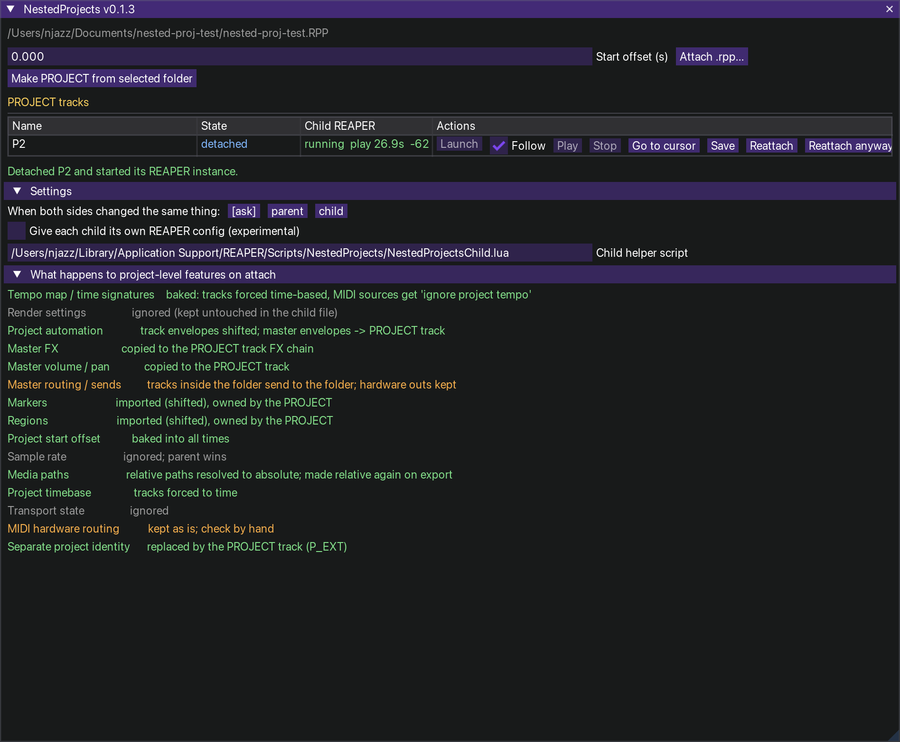

# NestedProjects v0.1.3 (prototype)



`PROJECT` folder tracks in a REAPER project that can be **attached** to / **detached** from a separate `.rpp`.

```
Main project                          PROJECTS/Intro/Intro.rpp   <- child, edited in its own REAPER
├── Music                                     ▲
├── Voice                                     │  merge on Sync / Reattach
└── PROJECT: Intro   <- folder track  ───────┘
      ├── Drums …
      └── Bass
```

| State | Where the tracks live | Transport / audio |
|---|---|---|
| **attached** | as children of the PROJECT folder in the parent | the parent's |
| **detached** | in a second REAPER instance editing `PROJECTS/<name>/<name>.rpp` | its own transport, its own audio device |
| **detached (shadow)** | both: muted copies stay in the parent, edits on both sides merge later | as above |

Audio between the two is deliberately not bridged: to hear a child through the parent, **Reattach** it.

## Install

`./install_mac.sh` (needs ReaImGui). Installs `NestedProjects.lua` + `NestedProjectsChild.lua` into
`Scripts/NestedProjects/` and registers both as actions. Keep the two files together. Run **Script: NestedProjects.lua**.

## Use

* **Attach .rpp…** picks a project; a working copy goes to `<parent folder>/PROJECTS/<name>/`. Your original is never written.
  *Start offset* puts the child's time zero at that time in the parent.
* **Make PROJECT from selected folder** turns an existing folder track into a PROJECT (its file is written at once).
* **Sync** merges both ways (tracks here ⇄ the child file). Non-overlapping edits combine automatically; when both sides changed
  the same thing you get a list and choose per conflict. Nothing is written until you press Apply.
* **Detach** removes the tracks (or mutes them: *keep shadow*), saves the merged state to the child file and starts a second
  REAPER for it. **Play / Stop / Go to cursor / Save** drive that instance; the Health column shows its heartbeat.
* **Reattach** asks the child to save and quit, waits, merges the file back in, restores the tracks.

### Transport: the child follows the parent

Each detached child has a **Follow** checkbox (on by default). While it is ticked the child plays, stops and seeks with this project's
transport. The parent does not send "press play": it sends the whole transport *state* (playing or not, position in the **child's own
time**, a timestamp). The child works out how long the message was on its way and starts that much further in, then corrects itself when it
has drifted more than 60 ms (the two audio clocks are never exactly equal, so the parent repeats the state once a second while playing).

* child time = parent time - (attach offset + the child's project start offset). Playing the parent *before* the child's start makes the
  child wait and start by itself at the right moment.
* The *Child REAPER* column shows `+12 ms` / `-40 ms`: how far ahead / behind the child is. Expect a few tens of ms, not sample accuracy.
* Untick *Follow* to run the child on its own; then Play / Stop / Go to cursor are enabled. *Go to cursor* converts to child time.
* Playrate is followed; loops, markers as cues and recording are not.

### If a child does not come up

The *Child REAPER* column tells you how far it got:

| Shows | Meaning |
|---|---|
| `starting...` | launched, nothing seen yet (up to 30 s) |
| `helper up, waiting...` | the helper script is running in the child, first status is coming |
| `running` | fully connected |
| `helper not started` | no helper after 30 s. A REAPER may have opened, but our script did not start in it. In that window run the action **Script: NestedProjectsChild.lua** once. *Copy launch command* gives you the exact Terminal command; `launch.log` and `helper.log` in `PROJECTS/<name>/.link/` are shown under the table |
| `lost` | the helper was seen and then went quiet (closed or crashed) |

*Settings > own REAPER config* (`-cfgfile`, for a separate audio device) is **off** by default: it is the least certain part
of the launch. REAPER treats the folder of that `reaper.ini` as its whole resource folder, so the child gets a private
`PROJECTS/<name>/.link/cfg/` with its own `reaper.ini` and **links** to everything else in your real resource folder
(license, scripts, plugins, actions). On Windows the license and action files are copied instead of linked.

## What is in the box

```
src/NPRpp.lua      .rpp text <-> tree, unknown lines kept byte-for-byte
src/NPXform.lua    child space <-> parent space: time offset, project start offset, timebase, media paths, MIDI tempo bake,
                   master -> PROJECT track. forward/backward are exact inverses (originals recorded in state.json)
src/NPSnap.lua     tracks / items / markers / master as ID-keyed entities; sends keyed by source-track GUID, not index
src/NPMerge.lua    three-way merge (base / parent / child), conflicts, order, delete-vs-edit
src/NPSync.lua     parent side of transport following: when to send, what to send
src/NPMail.lua     file mailbox (cmd/ack/status/parent heartbeat), health states, recovery planner, tiny JSON
src/NPChild.lua    logic of the helper inside the child instance
src/NPReaper.lua   REAPER glue: attach, detach, sync, reattach, launch, health   (the only untestable-offline layer)
src/NPApp.lua      state + tick, src/NPUI.lua window, src/NestedProjects*.lua entry points
tools/             build, mock REAPER, 9 test files (425 checks)      spikes/  Phase 0 scripts for real REAPER
```

`lua tools/build.lua` → `dist/`. `tools/run_tests.sh` runs everything offline.

## Status: what is verified and what is not

**Verified offline (mock REAPER):** parsing/round trip, transforms and their inversion, snapshot/render, every merge case
(disjoint edits, same-field conflicts, add/add, delete-vs-edit, reorder, reparent, moved items, send re-indexing, markers,
master), mailbox and health states, child helper commands, and the whole attach → sync → detach → launch → reattach flow
including "REAPER adds default lines to chunks" and "SetTrackStateChunk wipes P_EXT".

**Not verified: needs real REAPER (`spikes/SPIKES.md`).** The `.rpp` key names were written from memory (`MARKER` field order,
`MASTERFXLIST/FXCHAIN`, `PROJOFFS`, `IGNTEMPO`, `ISBUS a b`, master envelope block names), the exact behaviour of
`Set/GetTrackStateChunk`, `-newinst -cfgfile <script>` starting a working helper, and two instances sharing (or not) an audio device.

## Known limits (v0.1)

* Attaching the same project twice is refused (track GUIDs would collide). Copies need new GUIDs; not done yet.
* Tempo *changes* of the child are baked away, not imported. MIDI items keep their sound via "ignore project tempo"; a
  tempo change inside one MIDI item is reported, not solved. Beat-timebase items are forced to time.
* FX state that contains file paths (samplers) is not path-resolved. Hardware outputs / MIDI hardware routing are kept as they are.
* Take FX / take envelopes / automation items: shifted or kept as blocks, merged as whole blocks, not point by point.
* Sync rebuilds the folder's children from the merged result whenever the parent side has to change (one undo step).
* Windows launch command is written but untested. Only the parent project's active tab is supported.
